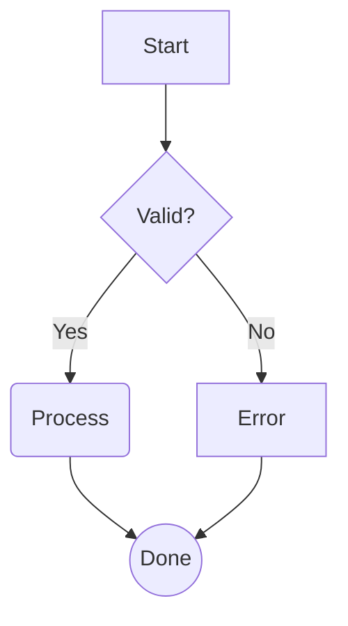
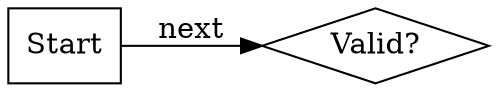

# SilkMark

A deliberately small GTK4-FFI Markdown browser written in Rust.

Example:

```sh
silkmark --stats -v https://example.org/large-document.md
```

## Design goals

- zero crates.io dependencies
- GTK 4 only as a native platform/UI backend through its C ABI
- system libcurl for HTTPS
- no WebView, Chromium, JavaScript, HTML engine or async runtime
- small, understandable browser state and Markdown renderer

### Image cache, zoom and animated GIF

PNG, JPEG and GIF images use the same HTTPS/relative URL resolver as Markdown links. A small LRU-like cache keeps at most 16 images and 32 MiB of image data. Clicking an inline image opens a larger native GTK image viewer. Animated GIFs advance frames in the inline document view using GdkPixbufAnimation; no Rust image crate is added.

### One relative URL resolver

Normal Markdown links and image sources now both use libcurl's URL API. The old duplicate URL resolver in `md.rs` has been removed. This covers `child.md`, `../api/ref.md#Section`, `/root/doc.md`, fragment-only links, query strings, spaces and Unicode while enforcing HTTPS.

### Shareable section URLs with `_`

Markdown headings have stable deep-link fragments. Whitespace and punctuation runs are represented by `_` in the canonical URL, making the end of a pasted URL unambiguous in plain-text mail or chat.

Example heading:

```md
## Első lépések: TCP/IP?
```

Canonical shareable URL:

```text
https://example.org/guide.md#els%C5%91_l%C3%A9p%C3%A9sek_tcp_ip
```

All of these are accepted and normalized to the canonical form:

```text
https://example.org/guide.md#Első lépések: TCP/IP?
https://example.org/guide.md#Els%C5%91%20l%C3%A9p%C3%A9sek%3A%20TCP%2FIP%3F
https://example.org/guide.md#els%C5%91-l%C3%A9p%C3%A9sek-tcp-ip
https://example.org/guide.md#els%C5%91_l%C3%A9p%C3%A9sek_tcp_ip
```

The old v0.9 `-` separator remains accepted for compatibility. `+` remains a literal plus; it is not decoded as a space.

Duplicate headings receive unique ids:

```text
#section
#section_1
#section_2
```

The `¶` permalink beside a heading navigates to and exposes its canonical URL. Bookmarks store the complete URL including the fragment, so a bookmarked section opens directly at that heading.

### Sidebar table of contents

The sidebar now contains a heading-based Contents section. H1/H2/H3 items are indented by hierarchy and navigate using fragment-only links, so same-document jumps do not trigger another HTTPS request.

The sidebar still contains persistent bookmarks and Markdown links found in the current document.

### Nested lists

Indented bullet and task-list levels are retained and rendered with matching indentation, for example:

```md
- level 1
  - level 2
    - level 3
  - [x] completed task
```

### Lightweight Markdown tables

Simple pipe tables are recognized without adding a Markdown dependency:

```md
| Name | Value |
|------|-------|
| One  | 1     |
| Two  | 2     |
```

They are rendered as compact monospace GTK rows. This is intentionally lightweight rather than a full CommonMark/GFM table layout engine.

## Existing browser features

- GTK 4 native UI through direct C ABI/FFI
- embedded Cairo-drawn navigation icons
- tabs with close buttons
- editable/copyable URL bar
- Back / Forward / Reload
- persistent bookmarks (`Ctrl+D`)
- command-line startup with one or more URLs
- 8-page in-memory document cache
- 16-entry / 32 MiB in-memory image cache
- clickable image viewer and inline animated GIF playback
- HTTPS through system libcurl
- heading deep links and fragment-aware Back/Forward
- selectable document text
- H1/H2/H3 typography
- bold, italic and inline code
- fenced code blocks
- quotes, horizontal rules, bullets and task lists
- clickable inline Markdown links
- zero crates.io dependencies

## Command-line startup

```sh
silkmark 'https://example.org/docs/guide.md#Első lépések: TCP/IP?'
```

Several URLs open in separate tabs:

```sh
silkmark https://example.org/a.md https://example.org/b.md#details
```

## Bookmarks

The star toolbar button or `Ctrl+D` toggles the current full URL. A section fragment is stored too.

Bookmarks are stored in:

- `$XDG_DATA_HOME/silkmark/bookmarks.tsv`, or
- `~/.local/share/silkmark/bookmarks.tsv`

No database is used.

## Keyboard shortcuts

- `Ctrl+L` focus/select URL
- `Ctrl+T` new tab
- `Ctrl+W` close active tab
- `Ctrl+R` reload from network
- `Ctrl+B` toggle sidebar
- `Ctrl+D` add/remove bookmark, including current section
- `Alt+Left` back
- `Alt+Right` forward

## Build dependencies

Debian/Ubuntu example:

```sh
sudo apt install cargo rustc pkg-config libgtk-4-dev libgdk-pixbuf-2.0-dev libcurl4-openssl-dev
cargo build --release
```

There are no Rust package dependencies in `Cargo.toml`.

## Current Markdown scope

The renderer deliberately supports a practical subset rather than embedding a full browser or CommonMark engine. Nested block quotes, complex tables, reference-style links and full CommonMark edge cases remain candidates for later iterations.


## Images (v0.12)

Markdown images are displayed inline for HTTPS or relative HTTPS resources:

```markdown


```

Supported formats: PNG, JPEG/JPG and GIF. Images are downloaded on background threads with a 12 MiB per-image limit. Oversized images are scaled down for display. Inline GIF animation uses GdkPixbufAnimation. Downloaded image bytes are cached up to 16 entries / 32 MiB, and clicking an image opens a larger GTK viewer.


## Relative links and images

Document links and image sources are resolved against the final HTTPS URL of the current Markdown document. Examples: `image.jpg`, `../img/image.jpg`, `/assets/image.jpg`, and signed/CDN URLs without a filename extension. PNG/JPEG/GIF detection is based on downloaded content, not the URL suffix.


## Verbose URL tracing

Use `-v` or `--verbose` to print each opened resource to stderr:

```sh
silkmark -v https://example.org/README.md
```

Typical output:

```text
[navigate] https://example.org/README.md
[open:document] https://example.org/README.md
[open:image] https://example.org/images/logo.jpg
[redirect:image] https://example.org/images/logo.jpg -> https://cdn.example.org/logo.jpg
[cache:image] https://cdn.example.org/logo.jpg
```

By default the browser selects GTK4 Adwaita when `GTK_THEME` is not already explicitly set. This avoids parser warnings caused by GTK3-only desktop themes. Use `--system-theme` to request the desktop-selected theme instead.


## v0.13 sidebar
The Bookmarks, Contents and Markdown links groups are individually collapsible by clicking their headers.

## Image viewer controls (v0.13)
Click an inline image to open the lightweight image viewer.

- `Fit` fits the image into the initial viewer viewport.
- `1:1` shows native pixel size.
- `-` zooms out by 1.25x.
- `+` zooms in by 1.25x.
- Zoom is limited to 5%..800%.

The left sidebar groups (Bookmarks, Contents, Markdown links) can be collapsed independently.

### Search and tab navigation (v0.14)
- `Ctrl+F`: find in the current Markdown document
- `Enter` / `Ctrl+G`: next match
- Previous/Next buttons: cycle matches
- `Esc`: close the find bar
- `Ctrl+Shift+T`: reopen the last closed tab


## v0.15 additions

- Ctrl+M: bookmark manager (rename/delete/up/down/open)
- Notebook tabs can be dragged to reorder; browser state follows the GTK order.

## Local files

SilkMark can open local Markdown in addition to HTTPS:

```bash
silkmark README.md
silkmark ../docs/manual.md#install
silkmark file:///home/user/docs/README.md
```

The URL bar accepts the same forms. Local relative Markdown links and images are resolved relative to the directory containing the current Markdown file. A local document may also link to an absolute `https://` resource.

## Markdown additions in 0.17

- H4 headings and anchors
- ordered lists (`1.`, `2.`, ...)
- strikethrough (`~~text~~`)

## Persistent HTTP cache and offline mode (v0.19)

SilkMark keeps its small in-memory caches. Persistent cache is opt-in:

```bash
silkmark --disk-cache https://example.org/docs/README.md
```

Cached HTTPS resources are stored under `$XDG_CACHE_HOME/silkmark/` or `~/.cache/silkmark/`. On later requests SilkMark sends `If-None-Match` and/or `If-Modified-Since` when the server supplied `ETag` or `Last-Modified`. A `304 Not Modified` response reuses the cached body.

Offline mode never accesses the network:

```bash
silkmark --offline https://example.org/docs/README.md
```

Local files continue to work normally in offline mode. Use `-v` to see cache hit/miss/revalidation events.

The persistent cache is capped at approximately 64 MiB and prunes older cached bodies first. Clear it with:

```bash
silkmark --clear-cache
```


## Session restore

When SilkMark starts without explicit URLs/files, it restores the previous tabs, active tab, document scroll positions, sidebar/tree state, and window size.

```bash
silkmark --no-restore
```

Session data is a small TSV file at `$XDG_STATE_HOME/silkmark/session.tsv` or `~/.local/state/silkmark/session.tsv`. Explicit command-line URLs/files skip restore.


## URL completion and deep links

Press `Ctrl+Space` in the address field to complete from bookmarks and tab history. If the address contains `#`, completion uses the headings in the active Markdown document. Press `Ctrl+Shift+C` or the **Copy link** button to copy the canonical current document/section URL.

## Math (v0.24)

SilkMark includes a deliberately small LaTeX-like math renderer intended for technical Markdown served over HTTPS. It does not embed a browser, MathJax or a full TeX engine.

Inline math:

```markdown
Energy: $E = mc^2$
```

Display math:

```markdown
$$
\\frac{-b \\pm \\sqrt{b^2 - 4ac}}{2a}
$$
```

Supported in this release: `^`, `_`, grouping with `{...}`, `\\frac`, `\\sqrt`, `\\text`, `\\mathrm`, `\\mathbf`, `\\mathit`, Greek letters, `\\sum`, `\\prod`, `\\int`, `\\infty`, `\\pm`, `\\times`, `\\cdot`, common comparisons/arrows/set symbols, and `\\left`/`\\right` delimiters.


### GitHub-compatible math syntax

SilkMark accepts the common GitHub Markdown math forms:

~~~~markdown
Inline: $E = mc^2$
Safe inline: $`\sqrt{3x-1}+(1+x)^2`$

$$
\frac{-b \pm \sqrt{b^2-4ac}}{2a}
$$

```math
\sum_{i=1}^{n} i
```
~~~~

The syntax is compatible, while the renderer deliberately implements a compact LaTeX-like subset rather than a full TeX/MathJax engine.

This is a compact documentation renderer, not a complete TeX implementation. Macros, `\\newcommand`, matrices, AMS environments and TikZ are intentionally out of scope for v0.24.


## Markdown completeness (v0.26)

SilkMark supports footnotes (`[^id]` / `[^id]: text`), common/numeric HTML entities, nested blockquotes, and preserves explicit ordered-list numbers. Raw HTML is displayed safely rather than executed.

## Table rendering (v0.27)

SilkMark renders GFM-style pipe tables as native GTK grids:

```markdown
| Left | Center | Right |
| :--- | :----: | ----: |
| text | wrapped content | 123 |
```

Cells support inline Markdown and links. Wide tables scroll horizontally, while individual cells wrap at a practical maximum width.


## Mermaid flowcharts

SilkMark renders a practical Mermaid flowchart subset natively from fenced `mermaid` blocks:



Supported directions are `TD`, `TB`, `BT`, `LR`, and `RL`. Supported node forms are `A[Rectangle]`, `B(Rounded)`, `C{Decision}`, and `D((Circle))`; `-->`, `---`, and labeled `-->|text|` edges are recognized. Other Mermaid diagram families intentionally remain source-code blocks for now.

## Graphviz/DOT graphs

SilkMark also renders a practical native DOT subset without invoking Graphviz:



Supported constructs include `graph`/`digraph`, `--`/`->`, `rankdir=TB/BT/LR/RL`, node `label`, common `shape` values (`box`, `rect`, `ellipse`, `circle`, `diamond`), and edge `label`. Unsupported DOT syntax falls back to the highlighted source block.

## Syntax highlighting
Fenced code blocks are highlighted without external syntax packages for: Rust, C, C++, C#, Java, Kotlin, Go, Swift, Nim, JavaScript, TypeScript, SQL, Lua, Ruby, PHP, Dart, Scala, Zig, Python, Shell, JSON, TOML, YAML, HTML/XML/SVG, LaTeX/TeX, Markdown, AsciiDoc, reStructuredText, CSS, JSON5/JSONC, INI/CFG, Dockerfile, Mermaid, and Graphviz/DOT. Common aliases such as `rs`, `c++`, `cs`, `c#`, `kt`, `golang`, `js`, `jsx`, `ts`, `tsx`, `rb`, `py`, `bash`, `yml`, `xml`, `tex`, `md`, `adoc`, `rst`, `jsonc`, `docker`, `mmd`, and `gv` are recognized. Unknown languages are rendered as plain monospace text. Highlighting is intentionally lightweight and documentation-oriented rather than compiler-grade.

## Regression checks

When a Rust/GTK4 development environment is available:

```sh
cargo test
cargo build --release
```

For a quick visual parser smoke test, open:

```sh
silkmark examples/regression-suite.md
```

The compatibility contract is documented in `COMPATIBILITY.md`.

## Development and safety

See `DEVELOPMENT.md`, `STABILIZATION.md`, and `SAFETY.md` for release, FFI, and robustness rules.

## Debian / Ubuntu package

Build a native `.deb` package with Debian's own shared-library dependency resolver:

```sh
sudo apt install cargo rustc pkg-config dpkg-dev libgtk-4-dev libgdk-pixbuf-2.0-dev libcurl4-openssl-dev
./tools/build-deb.sh
sudo dpkg -i silkmark.deb
```

`tools/build-deb.sh` builds the release binary, stages the package, asks `dpkg-shlibdeps`
for the exact runtime dependencies of the current Debian/Ubuntu system, and creates
`silkmark.deb`. An optional first argument selects another output filename.

### Reproducible container build

To build the `.deb` without depending on the host machine's installed libraries, use
the Podman-based build environment:

```sh
./tools/build-installer.sh
sudo dpkg -i installers/silkmark_*.deb
```

`tools/build-installer.sh` builds a Debian + Rust container image from
`tools/Containerfile`, runs `tools/build-deb.sh` inside it, and writes a versioned
installer to `installers/`.

### Prebuilt installer

Prebuilt `.deb` installers are published as GitHub Release assets (no zip) on version
tags. Download the latest from the GitHub Releases page, or directly:

```sh
curl -LO https://github.com/<owner>/silkmark/releases/latest/download/silkmark.deb
```

## Security

See `SECURITY.md` for the security model, input/resource boundaries, and native-FFI release guidance.
