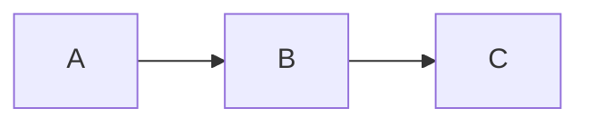

# Compatibility-oriented, less recommended extensions

SilkMark accepts these forms mainly for compatibility with existing documents. For new documents, prefer core Markdown or the recommended SilkMark forms.

## Raw HTML

```md
<div class="note">Note</div>
```

SilkMark **does not execute HTML**. Raw HTML is treated as safe literal content, so new documents should not depend on HTML for presentation.

**Recommended form:** use core Markdown structures such as paragraphs, lists, blockquotes, tables, and fenced code blocks.

## Plain HTTPS URLs

```md
https://example.org/docs
```

SilkMark recognizes them, but portable documents should prefer:

```md
<https://example.org/docs>
```

or:

```md
[Documentation](https://example.org/docs)
```

**Recommended form:** prefer a named Markdown link in normal prose; use the autolink form (`<https://...>`) when the URL itself should be displayed.

## Legacy heading fragments

For compatibility, some older hyphenated and raw/percent-encoded heading fragments are accepted.

**Recommended form:** use the canonical underscore-based permalink generated by SilkMark, preferably by copying the `¶` permalink next to the heading.

## DOT for simple flowcharts

DOT is supported, but for new SilkMark-focused documentation a simple Mermaid flowchart is usually easier to read.

**Recommended form:** use a `mermaid` fenced block with `flowchart`/`graph` syntax:



## Unsupported Mermaid dialects

For example:

````text
```mermaid
sequenceDiagram
...
```
````

SilkMark does not attempt partial interpretation. Unsupported Mermaid is shown as syntax-highlighted source. The current native renderer focuses on flowcharts.

**Recommended form:** stay within the supported `flowchart TD/TB/BT/LR/RL` subset. If the diagram cannot be expressed there, currently prefer a static image or a simple Markdown table/list.

## Full LaTeX/TeX documents

The SilkMark math parser is a documentation-oriented subset. Complex TeX macros, full preambles, packages, and arbitrary environments are not recommended because SilkMark is not a complete LaTeX implementation.

**Recommended form:** stay with the documented inline `$...$`, display `$$...$$`, or fenced `math` syntax and the formula elements explicitly supported by SilkMark.

## General rule

If the same content can be expressed with core Markdown, prefer the core form. Use a SilkMark extension when it adds real value to the document, and reserve compatibility syntax mainly for rendering existing content.

> **Note:** CommonMark raw HTML constructs are intentionally not part of SilkMark’s active rendering model; they are displayed as safe literal text.
