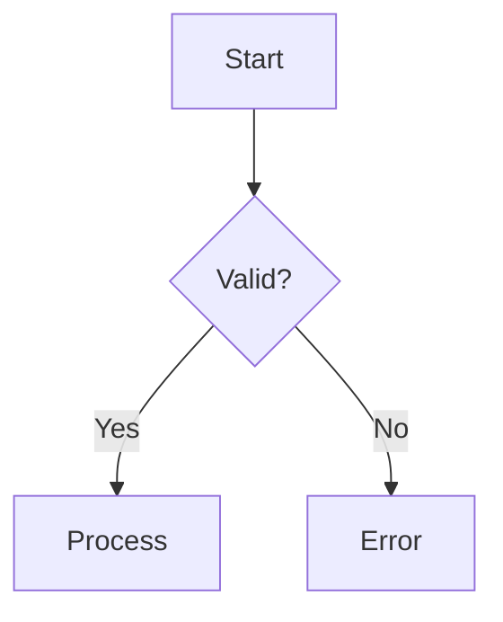
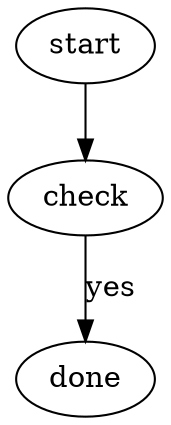

# Recommended SilkMark Markdown extensions

These features are suitable for new SilkMark documents. They provide stable, readable syntax for technical documentation.

## Strikethrough

```md
~~obsolete text~~
```

## Task lists

```md
- [ ] todo
- [x] done
```

## GFM tables

```md
| Name | Type | Status |
|:-----|:----:|-------:|
| API  | Rust | done |
```

Column alignment uses `:---`, `:---:`, and `---:`.

## Footnotes

```md
A statement.[^source]

[^source]: Detailed explanation.
```

Multiline footnote:

```md
[^detail]: First line.
    Second line with **emphasis**.

    - list item
```

## Mathematics

Inline:

```md
The result is $x^2 + y^2$.
```

Display:

```md
$$
\lim_{x\to0}\frac{\sin x}{x}=1
$$
```

Fenced math:

````md
```math
\frac{a+b}{c}
```
````

SilkMark uses its own lightweight TeX-like subset; it is not a full TeX engine.

## Mermaid flowcharts

````md

````

SilkMark renders the supported flowchart subset natively.

## Graphviz/DOT

````md

````

For a simple documentation flowchart, Mermaid is generally recommended. DOT is useful when the source already exists in Graphviz form.

## Syntax highlighting

A fenced code-block language identifier enables highlighting when supported:

````md
```csharp
public sealed class Example {}
```
````

Common supported languages include Rust, C, C++, C#, Java, Kotlin, Go, Swift, Nim, JavaScript, TypeScript, Python, Shell, JSON/JSON5, TOML, YAML, SQL, Lua, Ruby, PHP, Dart, Scala, Zig, HTML/XML, CSS, LaTeX/TeX, Markdown, AsciiDoc, reStructuredText, INI/CFG, Dockerfile, Mermaid, and DOT.

Unknown languages are still shown as normal code blocks.

## Stable section links

SilkMark generates canonical fragments from headings. For new links, prefer the permalink generated by SilkMark, for example:

```md
[Jump](#first_steps_tcp_ip)
```

Unicode characters may be percent-encoded in URLs.
