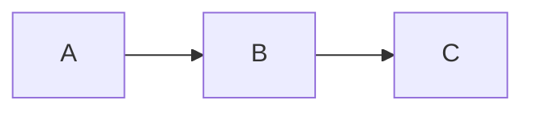

# Kompatibilitási, kevésbé ajánlott Markdown-kiterjesztések

Ezeket a SilkMark meglévő dokumentumok kompatibilitása miatt kezeli, de új dokumentumban általában célszerűbb a standard vagy SilkMark-ajánlott forma.

## Raw HTML

```md
<div class="note">Megjegyzés</div>
```

A SilkMark **nem futtat HTML-t**: a raw HTML biztonságos literális tartalomként jelenik meg. Emiatt új dokumentumban ne HTML-re építsünk formázást.

**Ajánlott megoldás:** használjunk standard Markdown elemeket (bekezdés, lista, blockquote, táblázat, fenced code block) a kívánt szerkezethez.

## Sima HTTPS URL

```md
https://example.org/docs
```

A SilkMark felismeri, de hordozható dokumentumhoz jobb az explicit forma:

```md
<https://example.org/docs>
```

vagy:

```md
[Dokumentáció](https://example.org/docs)
```

**Ajánlott megoldás:** általános esetben a névvel ellátott Markdown-linket használjuk; nyers URL bemutatásához az autolink (`<https://...>`) forma célszerű.

## Régi heading-fragment formák

A kompatibilitás miatt egyes régebbi kötőjeles vagy raw/percent-encoded fragmentek is elfogadhatók.

**Ajánlott megoldás:** új dokumentumban mindig a SilkMark által generált kanonikus `_`-os permalinket használjuk, lehetőleg a heading melletti `¶` permalink másolásával.

## DOT egyszerű flowcharthoz

DOT támogatott, de SilkMark-központú új dokumentációban egyszerű folyamatábrához a Mermaid olvashatóbb.

**Ajánlott megoldás:** használjunk `mermaid` fenced blokkot és `flowchart`/`graph` szintaxist:



## Nem támogatott Mermaid dialektusok

Például:

````md
```mermaid
sequenceDiagram
...
```
````

A SilkMark ezeket nem próbálja részlegesen értelmezni; syntax-highlighted forrásként jeleníti meg. A jelenlegi natív renderer flowchartra koncentrál.

**Ajánlott megoldás:** a támogatott `flowchart TD/TB/BT/LR/RL` részhalmazt használjuk. Ha a diagram nem fejezhető ki ezzel, jelenleg inkább statikus képet vagy egyszerű Markdown-táblázatot/listát használjunk.

## Teljes LaTeX/TeX

A SilkMark math parser dokumentációs részhalmaz. Komplex TeX makrók, teljes preambulum, csomagok és tetszőleges környezetek használata nem ajánlott, mert nem teljes LaTeX implementáció.

**Ajánlott megoldás:** maradjunk a dokumentált inline `$...$`, display `$$...$$` vagy fenced `math` szintaxisnál és a SilkMark által támogatott képletelemeknél.

## Általános szabály

Ha ugyanaz a tartalom kifejezhető standard Markdownnal, azt használjuk. SilkMark kiterjesztést akkor válasszunk, ha ténylegesen hozzáad valamit a dokumentációhoz; kompatibilitási formát pedig főleg már létező dokumentumok megjelenítésére tartsunk meg.

> **Megjegyzés:** A CommonMark raw HTML elemei szándékosan nem részei a SilkMark aktív megjelenítési modelljének; biztonságos literál szövegként jelennek meg.
