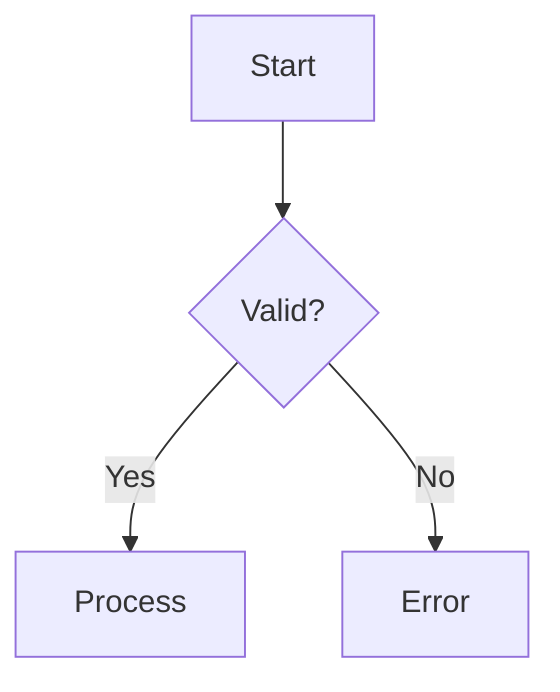
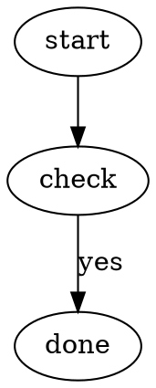

# SilkMark-ajánlott Markdown-kiterjesztések

Ezeket új SilkMark dokumentumokban nyugodtan érdemes használni. Dokumentációs célra stabil, olvasható szintaxisok.

## Áthúzás

```md
~~elavult szöveg~~
```

## Feladatlista

```md
- [ ] teendő
- [x] kész
```

## GFM táblázat

```md
| Név | Típus | Állapot |
|:----|:-----:|-------:|
| API | Rust  | kész |
```

Az oszlopigazítás `:---`, `:---:` és `---:` formával adható meg.

## Lábjegyzet

```md
Egy állítás.[^forras]

[^forras]: A részletes magyarázat.
```

Többsoros footnote:

```md
[^reszlet]: Első sor.
    Második sor **kiemeléssel**.

    - listaelem
```

## Matematika

Inline:

```md
Az eredmény $x^2 + y^2$.
```

Display:

```md
$$
\lim_{x\to0}\frac{\sin x}{x}=1
$$
```

Fenced math:

````md
```math
\frac{a+b}{c}
```
````

A SilkMark saját könnyű TeX-szerű részhalmazt használ; nem teljes TeX motor.

## Mermaid flowchart

````md

````

A SilkMark natívan rendereli a támogatott flowchart részhalmazt.

## Graphviz/DOT

````md

````

Egyszerű dokumentációs folyamatábrához általában a Mermaidet ajánljuk; DOT akkor célszerű, ha a forrás eleve Graphviz formátumú.

## Syntax highlighting

A fenced code block nyelvazonosítója kiemelést kapcsolhat be:

````md
```csharp
public sealed class Example {}
```
````

Gyakori támogatott nyelvek: Rust, C, C++, C#, Java, Kotlin, Go, Swift, Nim, JavaScript, TypeScript, Python, Shell, JSON/JSON5, TOML, YAML, SQL, Lua, Ruby, PHP, Dart, Scala, Zig, HTML/XML, CSS, LaTeX/TeX, Markdown, AsciiDoc, reStructuredText, INI/CFG, Dockerfile, Mermaid és DOT.

Ismeretlen nyelv esetén a blokk továbbra is kódként jelenik meg.

## Stabil szakaszlinkek

SilkMark headingekből kanonikus fragmentet készít. Új hivatkozásoknál a SilkMark által generált permalink használata ajánlott, például:

```md
[Ugrás](#első_lépések_tcp_ip)
```

Unicode karakterek URL-ben percent-encodingot kaphatnak.
