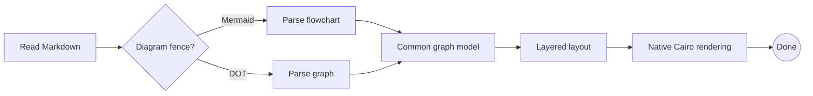
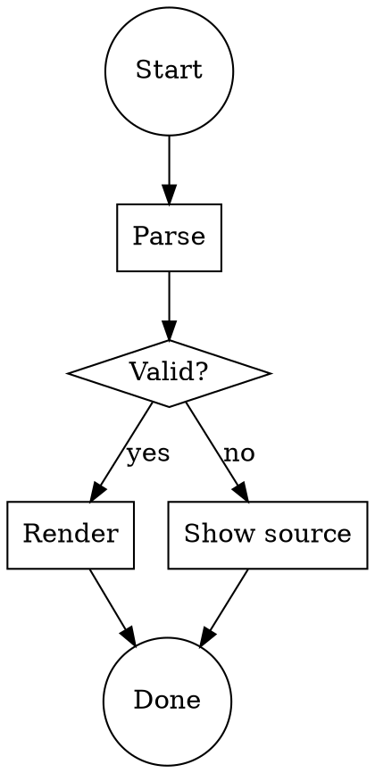

# Diagram zoom smoke test

Use the diagram toolbar to test **Fit**, **100%**, **+**, and **−**.

```mermaid
flowchart LR
    A[Read Markdown] --> B{Diagram fence?}
    B -->|Mermaid| C[Parse flowchart]
    B -->|DOT| D[Parse graph]
    C --> E[Common graph model]
    D --> E
    E --> F[Layered layout]
    F --> G[Native Cairo rendering]
    G --> H((Done))
```

```dot
digraph G {
    rankdir=TB;
    start [label="Start", shape=circle];
    parse [label="Parse", shape=box];
    valid [label="Valid?", shape=diamond];
    render [label="Render", shape=box];
    fallback [label="Show source", shape=box];
    done [label="Done", shape=circle];
    start -> parse;
    parse -> valid;
    valid -> render [label="yes"];
    valid -> fallback [label="no"];
    render -> done;
    fallback -> done;
}
```
