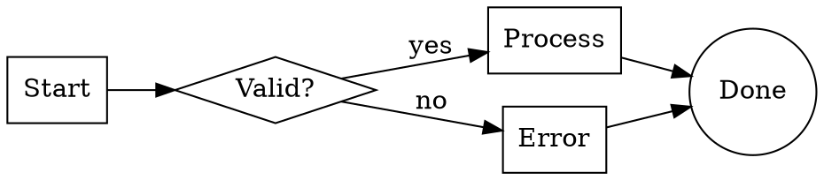
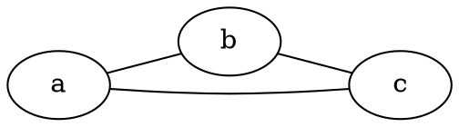

# Graphviz/DOT native rendering

```dot
digraph G {
    rankdir=LR;
    start [label="Start", shape=box];
    check [label="Valid?", shape=diamond];
    process [label="Process", shape=rounded];
    error [label="Error", shape=box];
    done [label="Done", shape=circle];

    start -> check;
    check -> process [label="yes"];
    check -> error [label="no"];
    process -> done;
    error -> done;
}
```

```graphviz
graph Network {
    rankdir=LR;
    a -- b;
    b -- c;
    c -- a;
}
```

Unsupported DOT remains visible as source code instead of disappearing.
