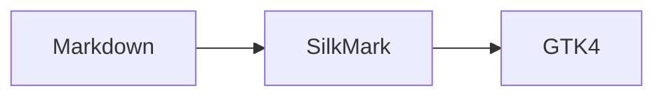
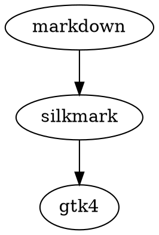

# Syntax highlighting

```rust
fn main() {
    let answer: i32 = 42;
    println!("answer = {answer}"); // comment
}
```

```c
#include <stdio.h>
int main(void) {
    const char *s = "hello";
    return 0;
}
```

```python
def greet(name):
    # comment
    return f"Hello {name}"
```

```bash
for f in *.md; do
    echo "$f"
done
```

```json
{"name": "SilkMark", "lightweight": true, "version": 0.28}
```

```toml
[package]
name = "silkmark"
version = "0.28.0"
```

```yaml
name: SilkMark
enabled: true
```

## More language fences

```csharp
public record User(string Name, int Age);
```

```java
public class Hello {
    public static void main(String[] args) {
        System.out.println("Hello");
    }
}
```

```kotlin
data class User(val name: String, val age: Int)
```

```go
package main

func main() {
    println("hello")
}
```

```swift
struct User {
    let name: String
}
```

```nim
proc greet(name: string) =
  echo "Hello ", name # comment
```

```typescript
interface User { name: string; age: number }
const user: User = { name: "Ada", age: 37 };
```

```sql
SELECT id, name
FROM users
WHERE active = true AND id >= 10;
```

```lua
local answer = 42 -- comment
print(answer)
```

```ruby
class User
  def initialize(name)
    @name = name
  end
end
```

```php
<?php
final class User {
    public function __construct(public string $name) {}
}
```

```dart
final class User {
  const User(this.name);
  final String name;
}
```

```scala
case class User(name: String, age: Int)
```

```zig
pub fn main() void {
    const answer: u32 = 42;
}
```


## Documentation-oriented formats

```html
<section class="note">
  <h2>Native Markdown</h2>
</section>
```

```latex
\section{Introduction}
The result is $x^2 + y^2$. % a comment
```

```markdown
## Section

- item
- **important** item
```

```asciidoc
== Installation
// comment
Run the following command.
```

```rst
Installation
============

.. note:: Native renderer
```

```css
.reader {
  max-width: 78rem;
  line-height: 1.6;
}
```

```json5
{
  // comments are allowed
  title: 'SilkMark',
  enabled: true,
}
```

```ini
[reader]
zoom = 100
; local preference
```

```dockerfile
FROM rust:latest
WORKDIR /src
RUN cargo build --release
```




