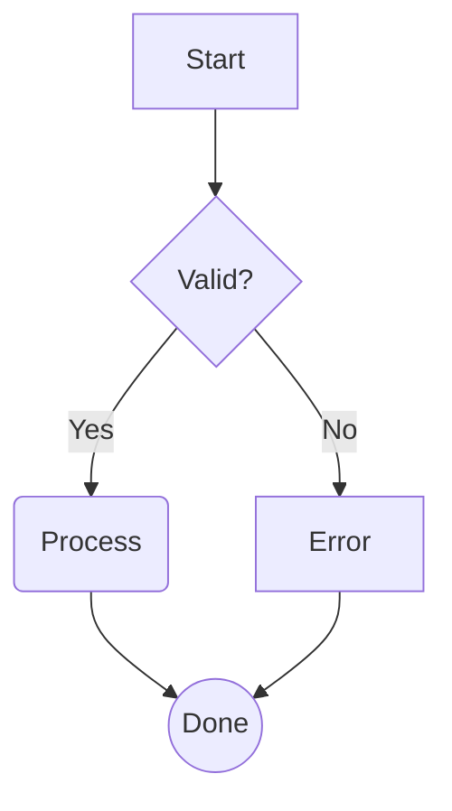
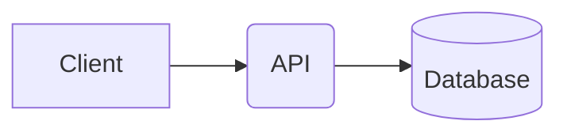
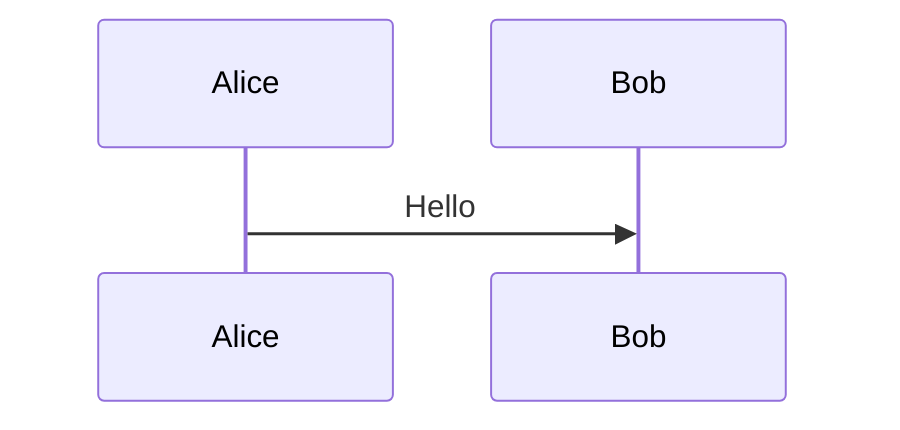

# Native Mermaid flowchart

```mermaid
flowchart TD
    A[Start] --> B{Valid?}
    B -->|Yes| C(Process)
    B -->|No| D[Error]
    C --> E((Done))
    D --> E
```

## Horizontal

```mermaid
graph LR
    Client[Client] --> API(API)
    API --> DB[(Database)]
```

Unsupported Mermaid kinds deliberately remain visible as source code.

```mermaid
sequenceDiagram
    Alice->>Bob: Hello
```
