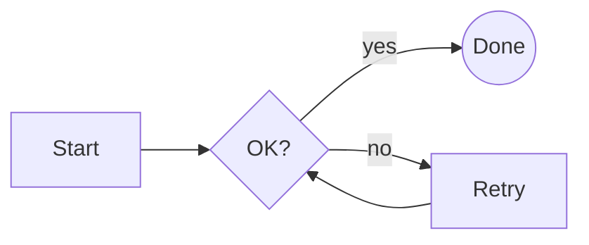
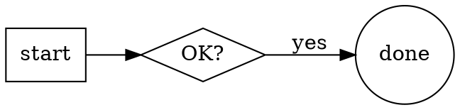

# Diagram smoke corpus

```mermaid
flowchart LR
    A[Start] --> B{OK?}
    B -->|yes| C((Done))
    B -->|no| D[Retry]
    D --> B
```

```dot
digraph G {
    rankdir=LR;
    start [shape=box];
    check [shape=diamond, label="OK?"];
    done [shape=circle];
    start -> check;
    check -> done [label="yes"];
}
```
